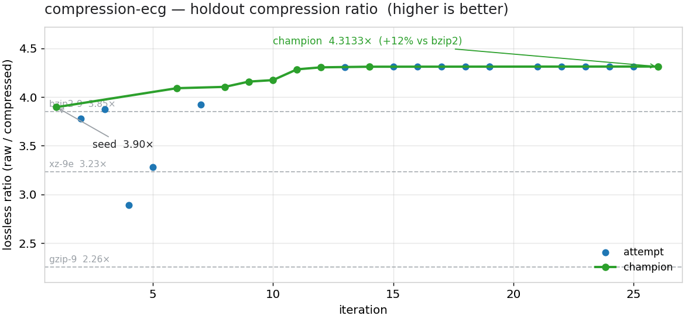
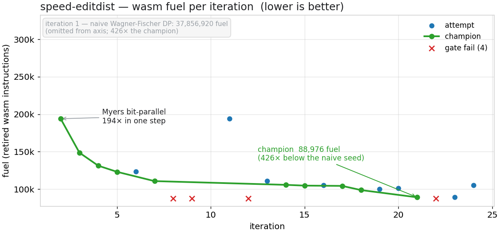

# Greg Overton's Claude Code plugins

A personal [Claude Code](https://code.claude.com) plugin marketplace.

```
/plugin marketplace add The-Greg-O/claude-plugins
/plugin install recursive-improvement-loop@the-greg-o
```

Updates are picked up with `/plugin marketplace update`.

---

## recursive-improvement-loop

Run **recursive-improvement experiments**: long-running agentic optimization loops
where each iteration is a *fresh-context* Claude that reads a living lab notebook,
forms ONE hypothesis, implements it, gets judged by a **trusted measurement
harness**, documents the result, and exits. Hundreds of iterations, zero context
rot, unattended on your subscription — with a hard anti-cheating gate, a champion
ratchet, a statistical plateau stop, a live dashboard, and a full audit trail.

The shape is **a loop of disposable agents around durable artifacts**:

```
runner.sh                one fresh `claude -p` per iteration (the "Ralph" loop)
  └─ iteration agent     reads notebook → ONE hypothesis → implement →
       └─ loop.py        TRUSTED HARNESS: sole writer of results / leaderboard
            └─ evaluate.py   THE ONLY DOMAIN CODE — gate + metrics contract
```

The **harness**, not the agent, owns scoring and the stop decision. The agent never
grades itself: it submits a candidate, a gate it cannot edit checks correctness, and
a metric it cannot edit measures progress. The one thing you write per problem is a
single `evaluate.py`. [Full plugin docs →](plugins/recursive-improvement-loop)

---

## See it work

Two real runs, each captured as a reproducible case study with a `verify.sh` that
re-derives the headline number on any machine. The charts below are the actual
champion trajectories.

### 1 · Lossless ECG compression — beats bzip2 by 12%



From a 3.90× seed (delta + LZMA), the loop evolved a lossless codec for **MIT-BIH
ECG** to **4.31× — +12% past bzip2-9**, the strongest general-purpose baseline. It
earned it: it discovered that bzip2 wins by dictionary-matching the repeating
heartbeat, ruled out beat-to-beat prediction (it's an *arrhythmia* database),
survived an 11-iteration plateau, and broke through with **NLMS adaptive
prediction** — documenting every dead end in its
[lab notebook](examples/compression-ecg/LAB_NOTEBOOK.md).

```bash
cd examples/compression-ecg && ./verify.sh      # → champion 4.3133× vs bzip2 3.85×
```
[Case study →](plugins/recursive-improvement-loop/skills/recursive-improvement-loop/references/examples/compression-ecg.md)

### 2 · A faster Rust algorithm — 425× fewer instructions



This is [AlphaDev](https://www.nature.com/articles/s41586-023-06004-9)'s setup —
minimize instruction count for a fixed kernel under a byte-exact correctness gate —
but the fitness is **deterministic Wasmtime/wasmi fuel**, so the number is identical
on every machine. From a naive Wagner-Fischer DP (37.9M fuel, off-chart at iteration
1), the loop **rediscovered Myers bit-parallelism on its own** (194× in a single
leap), then *beat the textbook*: affix-trimming, WASM-level micro-optimization, and a
closed-form popcount invariant for the score — reaching **88,976 fuel, 425× below
naive.**

```bash
cd examples/speed-editdist && ./verify.sh        # → champion 88,976 fuel vs 37.9M naive
```
[Case study →](plugins/recursive-improvement-loop/skills/recursive-improvement-loop/references/examples/speed-editdist.md)

---

## Run your own

A loop fits a problem when three things hold — it's **measurable** (a script computes
a number), **gateable** (a hard pass/fail separates valid from invalid), and
**iterable** (one eval runs in seconds-to-minutes).

```bash
# 1. scaffold an experiment (the harness travels with it)
python3 <plugin>/skills/recursive-improvement-loop/scripts/loop.py init my-experiment
cd my-experiment

# 2. write the ONE thing that is yours — evaluate.py — to a 10-line contract:
#    <eval_cmd> <candidate>  →  final stdout line:
#    {"gate_passed": true, "gate_error": "", "metrics": {"score_holdout": 4.01}}

# 3. seed, baseline, then run — fresh claude -p per iteration
python3 loop.py eval --candidate candidates/seed
./runner.sh -n 30 -p 12          # watch the terminal + dashboard.html
```

Everything else — the loop, the champion ratchet, the plateau stop, the notebook,
the dashboard, the audit — is generic. See the interview-driven
`/recursive-improvement-loop:init` flow, the
[evaluator guide](plugins/recursive-improvement-loop/skills/recursive-improvement-loop/references/evaluator-guide.md),
and the
[design principles](plugins/recursive-improvement-loop/skills/recursive-improvement-loop/references/design-principles.md)
in the plugin docs.

> **Safety:** `runner.sh` drives an autonomous agent with
> `--dangerously-skip-permissions`. Run it in a dedicated, version-controlled
> experiment directory. Trust boundaries are enforced in software — the agent cannot
> edit the harness or its evaluator, never scores itself, and candidate code runs
> sandboxed.

## License

[MIT](LICENSE). The ECG example uses the MIT-BIH Arrhythmia Database (ODC-By 1.0; see
[`examples/compression-ecg/NOTICE`](examples/compression-ecg/NOTICE)). The data is
fetched on demand, not redistributed here.
